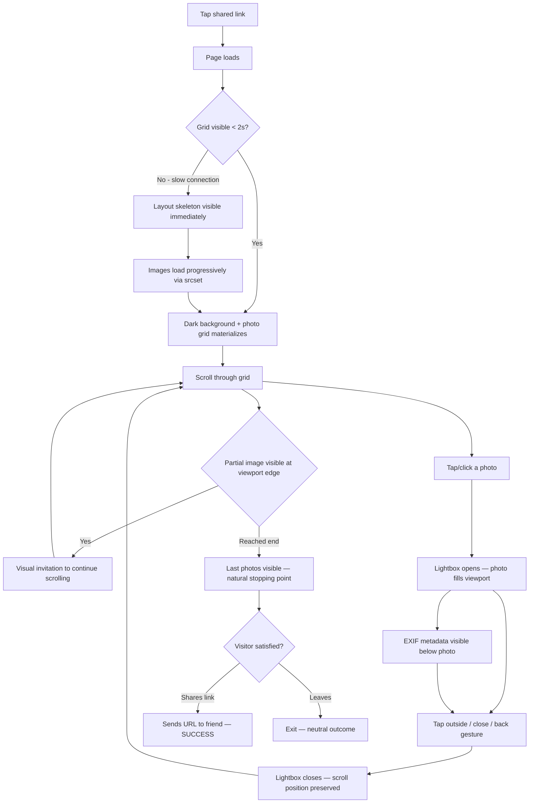
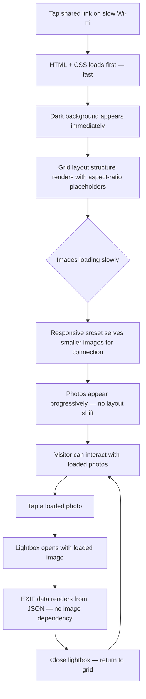
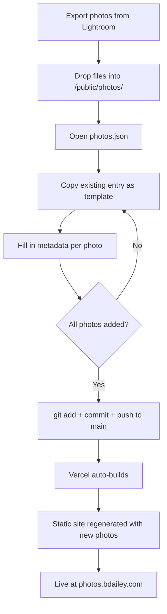

# UX Design Specification - projectGlass

**Author:** Bryan
**Date:** 2026-02-10

---

## Executive Summary

### Project Vision

A single-page photo portfolio at photos.bdailey.com showcasing travel and vacation photography. The entire product is one interaction loop: land → browse grid → tap photo → immerse → return to grid. Simplicity is the design strength — there's nowhere to get lost, nothing to figure out. Just photos, served fast.

### Target Users

**Visitor (Sarah archetype):** Friends and family tapping a shared link, typically on mobile. Browsing mindset, not task-completion mindset. Designing for wandering, not wayfinding.

**Site Owner (Bryan):** No UI to design — content management is JSON + git. UX consideration is limited to data schema simplicity (architecture concern, not visual design).

### Key Design Challenges

1. **Overview-vs-detail tension** — Masonry grid must show images large enough to be compelling but small enough to communicate breadth. Breakpoint-responsive column count (1→2→3) is the lever, but the feeling of each tier matters.

2. **Below-the-fold discovery** — Visitor must intuitively know the grid continues. If the last visible row is complete and neatly cut off, it looks "done." Requires intentional partial visibility at the viewport edge.

3. **Lightbox as sacred space** — Distraction-free means the lightbox is a context shift, not just an overlay. The photo must breathe. EXIF data must be present but subordinate — visible without competing with the image.

### Design Opportunities

1. **Dark gallery aesthetic** — Dark background makes photos pop. The UI disappears; images become the entire experience.

2. **Hover/tap micro-interactions** — Subtle scale-on-hover creates life and responsiveness. The grid feels alive, not static. Even minimal animation elevates perceived quality.

3. **EXIF as storytelling** — Showing technical data signals craft and seriousness. Placement and typography of EXIF data can elevate the whole experience from "photo dump" to "gallery."

## Core User Experience

### Defining Experience

The core experience is **browsing, not viewing**. The masonry grid is the product — the lightbox is a reward for curiosity. Success is measured by whether visitors scroll, linger, and absorb the breadth of the collection. Everything serves the grid.

**Core Action:** Scrolling through a visually rich, dense photo grid with zero friction.

### Platform Strategy

- **Primary platform:** Mobile web (link-shared via text/social)
- **Secondary:** Desktop web (larger viewport, mouse-driven)
- **Interaction model:** Touch-first (tap, scroll, swipe). Mouse hover as enhancement on desktop.
- **No offline requirement.** No native app. No PWA for MVP.
- **Performance is the platform feature** — under 2 seconds load means the experience begins almost instantly regardless of device.

### Effortless Interactions

1. **Scrolling** (highest priority) — The grid must flow like water. No jank, no layout shifts, no stuttering. Scrolling is the primary interaction and it must feel native.
2. **Below-the-fold discovery** — A clear visual indicator that content continues. The visitor should never wonder "is that all?" Intentional partial image visibility at viewport edge.
3. **Tap-to-view transition** — Entering the lightbox should feel like stepping closer to a photo on a gallery wall, not opening a popup.
4. **Return to grid** — Closing the lightbox returns the visitor exactly where they were. No scroll position loss, no disorientation.

### Critical Success Moments

**"This is different" moment:** The visitor lands and immediately feels the lack of clutter — no navigation bars competing for attention, no cookie banners, no hero sections. Just a clean header and photos. The cohesive typography and dark aesthetic signal intentional design, not a template.

**"This is quality" moment:** The grid loads fast and the images are sharp. The layout is tight and deliberate — not randomly thrown together. Font choices, spacing, and color feel hand-picked.

**Deal-breaker failures:**
- Slow page load (breaks the instant-gratification expectation)
- Layout shift during image loading (destroys the feeling of polish)
- Clunky lightbox interaction (popup feeling instead of immersive)

### Experience Principles

1. **The grid is the product** — Every design decision serves the browsing experience first. If it doesn't help the grid, it doesn't belong.
2. **Invisible UI** — The interface should disappear. Dark background, minimal chrome, no competing elements. Photos are the only visual priority.
3. **Curated craft** — Hand-picked fonts, deliberate spacing, cohesive color palette. Every detail signals "someone cared about this." Nothing generic or template-feeling.
4. **Scroll is sacred** — Scrolling must be the smoothest, most frictionless interaction in the entire experience. Zero jank, zero surprises.

## Desired Emotional Response

### Primary Emotional Goals

**Primary: Calm and immersed** — The experience should feel like walking into a quiet gallery. No urgency, no calls to action, no competing demands for attention. The world outside the browser disappears. The visitor exists in a space created entirely for looking at photographs.

**Exit emotion: "I want to share this"** — The lasting impression isn't "that was a nice website" — it's the urge to show someone else. The experience is worth passing along. This is the ultimate success metric for emotional design.

### Emotional Journey Mapping

| Stage | Desired Emotion | Design Implication |
|-------|----------------|-------------------|
| **Landing** | Calm arrival — immediate visual reward | Dark background, no splash screen, grid appears instantly. No noise. |
| **Browsing** | Quiet immersion — meditative scrolling | Smooth scroll, consistent rhythm, no interruptions or popups |
| **Tapping a photo** | Deeper stillness — the room gets quieter | Lightbox darkens everything else. Photo breathes. Silence. |
| **Viewing EXIF** | Quiet appreciation — respect for craft | Small, elegant typography. Data serves the image, never competes. |
| **Returning to grid** | Seamless continuity — never jarred | Scroll position preserved. Transition feels like stepping back, not closing a dialog. |
| **Leaving** | "I want to share this" | The whole experience lingers. They send the link. |

### Micro-Emotions

**Cultivate:**
- **Confidence** — The visitor always knows where they are and how to navigate. No confusion, no dead ends.
- **Trust** — The site feels solid, fast, and reliable. Nothing breaks, nothing lags.
- **Delight (subtle)** — Small moments of polish — hover effects, smooth transitions — that feel intentional without demanding attention.

**Prevent:**
- **Anxiety** — No unexpected behaviors, no jarring transitions, no layout jumps.
- **Impatience** — Nothing should ever make them wait. If they notice loading, the spell is broken.
- **Confusion** — Zero learning curve. The interaction model is self-evident.

### Design Implications

- **Calm → Dark, spacious design.** Generous padding. No bright accent colors competing with photos. The UI whispers.
- **Immersion → No chrome.** Minimal header. No footer navigation. No sidebar. The grid extends edge to edge with only necessary margin.
- **"Never happens" errors → Defensive design.** Static generation eliminates server errors. Image optimization prevents failed loads. Layout stability prevents visual glitches. The site should feel unbreakable.
- **Shareability → Beautiful link previews.** Open Graph meta tags with a compelling preview image so the shared link itself looks good in text messages and social.

### Emotional Design Principles

1. **Design for stillness** — The interface creates calm, not excitement. Every element earns its place by contributing to quietude.
2. **Errors are design failures** — If a visitor encounters any friction, the emotional contract is broken. Design defensively so nothing ever goes wrong.
3. **The share is the applause** — The experience succeeds when someone sends the link to a friend. Design the entire journey to be worth sharing.

## UX Pattern Analysis & Inspiration

### Inspiring Products Analysis

**Old Instagram (photo-focused era)**
- Single-column, full-width photos in a vertical feed
- Each image given its own moment — no competing visual elements
- Scrolling creates a sequential viewing experience, like flipping through a book
- The simplicity made the photos the entire experience
- **Lesson:** On mobile, give each photo the full stage. Don't miniaturize.

**Apple Product Pages**
- Cinematic, scroll-driven storytelling on dark backgrounds
- Generous whitespace creates breathing room
- Typography is precise, intentional, and subordinate to visual content
- The scroll itself is the interaction — fluid, rewarding, continuous
- **Lesson:** Dark backgrounds, curated typography, and spacious layouts create a premium, calm feeling. Scrolling should feel like a journey.

### Transferable UX Patterns

**Layout Patterns:**
- **Mobile: Full-width single-column feed** — Each photo spans the viewport width. Visitor scrolls through a sequence, not a grid. Images are large enough to appreciate without tapping. (Instagram pattern)
- **Tablet: 2-column masonry** — Transition to grid at 640px+. Images still substantial but density increases to show range.
- **Desktop: 3-column masonry** — Full gallery overview. The "breadth" view. Images are large enough to intrigue, dense enough to impress. (Pinterest/gallery pattern)

**Interaction Patterns:**
- **Scroll as primary interaction** — No pagination, no "load more" buttons. The content flows continuously. (Instagram/Apple)
- **Tap/click to immerse** — Single tap enters lightbox. No intermediate states, no hover menus. Direct. (Standard gallery)
- **Scroll position memory** — Return from lightbox to exact scroll position. Never lose context. (Instagram)

**Visual Patterns:**
- **Dark canvas** — Near-black background lets photos define the color palette of the page. (Apple)
- **Typographic restraint** — One font family, limited weights, muted colors for text. Let typography be felt, not seen. (Apple)
- **Edge-to-edge images on mobile** — Minimal horizontal margin. The photo IS the viewport. (Instagram)

### Anti-Patterns to Avoid

- **Thumbnail grids with tiny images** — Forces users to click to see anything. Violates "browsing is the product" principle.
- **Infinite masonry on mobile** — Small, cramped images on a phone screen feel like a contact sheet, not a gallery.
- **Pagination or "load more" buttons** — Breaks the flow state. The scroll should never be interrupted.
- **Heavy UI overlays on hover** — Title bars, share buttons, like counts appearing over images destroy the calm.
- **Slow lightbox transitions** — Popups with loading spinners break immersion. If it's not instant, it's broken.
- **Cookie banners and promotional overlays** — Immediate emotional contract violation. No interruptions.

### Design Inspiration Strategy

**Adopt:**
- Full-width single-column on mobile (Instagram pattern)
- Dark canvas aesthetic (Apple pattern)
- Scroll-driven continuous feed — no pagination
- Typographic restraint — one curated font family

**Adapt:**
- Masonry grid for tablet/desktop only — mobile gets the feed treatment
- Apple's spacious layout adapted to image density (generous spacing between images, but images remain the dominant element)

**Avoid:**
- Any UI that competes with photos for attention
- Tiny thumbnails on any viewport
- Interrupted scroll flow (pagination, load-more, banners)
- Hover overlays or social interaction chrome

## Design System Strategy

### Approach: Tailwind CSS + Fully Custom Components

**Decision:** No component library. All UI built with Tailwind utility classes and custom components.

**Rationale:**
- The entire product has ~3 components (gallery grid, lightbox, header). A component library would be massive overhead for negligible benefit.
- Maximum visual control — every pixel serves the gallery aesthetic. No fighting library defaults or overriding opinionated styles.
- Zero dependency weight — no UI framework CSS to ship, tree-shake, or maintain.
- Tailwind's utility-first approach is the design system. Config defines the constraints; utilities enforce them.

**Tailwind Config as Design System:**
- **Colors:** Dark palette anchored to `gray-950` background. Muted text colors. No accent colors competing with photos.
- **Typography:** Single curated font family, limited weight scale, constrained size scale.
- **Spacing:** Consistent spacing scale for grid gaps, padding, and margins. Rhythm matters.
- **Breakpoints:** Three tiers — mobile (<640px), tablet (640-1024px), desktop (>1024px) — driving column count and layout shifts.

**Components Needed (MVP):**
1. **Gallery Grid** — Masonry layout on tablet/desktop, single-column feed on mobile. The entire product surface.
2. **Lightbox** — Full-screen overlay with photo, EXIF data, and close interaction. The immersive detail view.
3. **Page Header** — Minimal branding. Site title, possibly a subtitle. Must not compete with photos.

**What We Don't Need:**
- No forms, buttons, inputs, modals, dropdowns, navigation menus, data tables, cards, or alerts.
- No design tokens beyond what Tailwind config provides.
- No component documentation or Storybook — three components don't need a catalog.

## Defining Experience

### The Core Interaction

**One-line description:** *"Land on a dark wall of photographs and scroll through them."*

That's what visitors would describe to a friend. Not "I used a lightbox" or "I saw EXIF data." They'd say: *"Bryan has this site — it's just his photos, beautifully laid out on a dark background. You just scroll through them."*

The defining experience is the **meditative scroll through a curated photo gallery**. The visitor doesn't do anything complex. They land, they scroll, they absorb. The scroll IS the experience.

### User Mental Model

Visitors arrive with a **social media feed** mental model — they expect to scroll vertically through visual content. No learning curve because the pattern is universal:

- **How they currently browse photos:** Instagram, iMessage photo shares, Google Photos shared albums
- **What they expect:** Vertical scroll, tap to enlarge, back to return
- **What they love:** Big images, fast loading, no friction
- **What they hate:** Tiny thumbnails, slow loads, popups, sign-up walls, cookie banners
- **The mental model shift:** This isn't a social feed — there are no likes, comments, or profiles. The absence of social chrome creates the gallery feeling. Same scroll muscle, completely different emotional context.

### Core Experience Success Criteria

The core experience succeeds when:

1. **The grid appears before the visitor consciously "waits"** — perceived instant load
2. **Scrolling feels native** — no jank, no stutter, no layout shifts. Indistinguishable from OS-level scroll.
3. **Images are large enough to appreciate without tapping** — especially on mobile where each photo fills the viewport width
4. **The visitor scrolls past the fold without hesitation** — the partial image at the viewport edge pulls them down naturally
5. **The dark background disappears from awareness** — photos become the entire perceptual field
6. **Returning from lightbox feels like "stepping back"** — not "closing a popup." Scroll position preserved, context intact.

### Novel vs. Established Patterns

**Verdict: 100% established patterns, executed with unusual care.**

No novel interaction design needed. Every pattern is proven:
- Vertical scroll feed (universal)
- Masonry/column grid (Pinterest, 500px, galleries everywhere)
- Tap-to-lightbox (standard gallery pattern)
- Dark background photo display (every serious photography site)

**The unique twist isn't the pattern — it's the restraint.** What makes this different from every other gallery is what's *missing*: no navigation, no social features, no sidebars, no footer, no categories, no search. The radical simplicity IS the differentiator. The visitor notices the absence of noise, not the presence of features.

### Experience Mechanics

**1. Initiation — Landing:**
- Visitor taps a shared link → page loads → dark background appears first → grid of photos materializes
- No splash screen, no loading animation, no hero image. The grid IS the landing experience.
- Header is minimal: site title in restrained typography. Eyes go immediately to photos.

**2. Interaction — Browsing:**
- **Mobile:** Full-width photos in a vertical feed. Each image gets its own moment. Scroll down to see the next.
- **Tablet:** 2-column masonry. Images substantial, density shows range.
- **Desktop:** 3-column masonry. The "gallery overview" view. Breadth and depth visible simultaneously.
- **Hover (desktop only):** Subtle scale transform on mouse-over. The grid feels alive, responsive.
- **Below the fold:** Last visible image is intentionally cut off at the viewport edge — visual invitation to keep scrolling.

**3. Feedback — Immersing:**
- Tap/click any photo → lightbox opens → photo fills the viewport against deep black
- EXIF metadata displayed in small, elegant typography below or beside the photo — present but subordinate
- The transition should feel like the room got quieter — not like a modal opened

**4. Completion — Returning:**
- Tap outside photo / close button / back gesture → lightbox closes → grid returns at exact scroll position
- No disorientation. The visitor picks up exactly where they left off.
- There is no "end state" — the experience completes when the visitor has seen enough and leaves satisfied, or shares the link.

## Visual Design Foundation

### Color System

**Palette Inspiration: Tokyo Night**

The Tokyo Night palette provides a dark foundation with blue-purple undertones — warmer and more intentional than pure black/gray. This gives the gallery a feeling of depth and atmosphere, like a dimly lit exhibition space rather than a void.

**Background Layers:**
- **Primary background:** `#1a1b26` (Tokyo Night "night") — The gallery wall. Deep, almost-black with a subtle blue undertone that distinguishes it from flat `#000`.
- **Surface/elevated:** `#24283b` (Tokyo Night "storm") — For subtle separation where needed (header area, EXIF container in lightbox).
- **Lightbox overlay:** `#16161e` (Tokyo Night "dark") — Deeper than the gallery wall. When the lightbox opens, the room gets even darker.

**Text Colors:**
- **Primary text:** `#c0caf5` — Soft blue-white. High readability against dark backgrounds without the harshness of pure white.
- **Secondary text:** `#a9b1d6` — Muted. For EXIF data, subtle labels, secondary information.
- **Tertiary/subdued:** `#565f89` — For the quietest text. Timestamps, technical details that are present but subordinate.

**Accent (minimal use):**
- **Soft blue:** `#7aa2f7` — Only for interactive affordances if absolutely needed (focus rings, hover states). Never decorative. The photos provide all the color this site needs.

**Principle:** The color system exists to *disappear*. These aren't brand colors — they're atmosphere. The blue undertone in the dark backgrounds subtly shifts the mood from "dark theme" to "gallery at night."

### Typography System

**Font Strategy: One family, restrained usage.**

**Primary typeface:** Inter (or similar geometric sans-serif — clean, modern, excellent at small sizes)
- Widely available via Google Fonts / system font stack
- Exceptional legibility at the small sizes we'll use for EXIF data and headers
- Geometric precision signals intentional design without drawing attention
- Variable font support for fine-grained weight control

**Type Scale (minimal):**

| Element | Size | Weight | Color | Usage |
|---------|------|--------|-------|-------|
| Site title | `text-lg` / 18px | 300 (light) | `#c0caf5` | Header — quiet, not shouting |
| Photo title (lightbox) | `text-base` / 16px | 400 (regular) | `#c0caf5` | Visible but subordinate to image |
| EXIF data | `text-xs` / 12px | 400 (regular) | `#a9b1d6` | Present but whispering |
| EXIF labels | `text-xs` / 12px | 300 (light) | `#565f89` | Nearly invisible until you look |

**Typographic Principles:**
- **Light weights preferred** — Bold competes with photos. Light/regular weights let typography recede.
- **Small sizes by default** — Text is metadata, not content. The photos are the content.
- **Letter-spacing on small text** — Slight tracking on EXIF data improves legibility at 12px and adds a refined quality.
- **No headings in the gallery** — The grid has no section headers, no captions, no titles. Just photos on a dark wall.

### Spacing & Layout Foundation

**Spacing Philosophy: Generous between photos, tight within components.**

**Grid Gaps:**
- **Mobile (single column):** `gap-3` (12px) between full-width photos. Enough to separate, not enough to break the vertical rhythm.
- **Tablet (2-column):** `gap-3` (12px) between masonry items. Consistent with mobile.
- **Desktop (3-column):** `gap-4` (16px) between masonry items. Slightly more room as the layout gets denser.

**Page Margins:**
- **Mobile:** `px-0` — Edge-to-edge photos. The photo IS the viewport. (Instagram pattern)
- **Tablet:** `px-4` (16px) — Minimal breathing room at edges.
- **Desktop:** `px-6` to `max-w-7xl mx-auto` — Constrained width with centered layout. Photos don't stretch infinitely on ultrawide displays.

**Header Spacing:**
- Minimal vertical padding: `py-4` to `py-6`. The header earns only the space it needs to establish identity, then gets out of the way.

**Lightbox Spacing:**
- Photo centered with generous padding from viewport edges
- EXIF data positioned below the photo with `mt-3` (12px) separation
- The photo breathes — never crammed against edges

**Layout Principles:**
1. **Photos touch the edges on mobile** — No horizontal margin. Maximum image real estate.
2. **Consistent gap rhythm** — Same gap value within a breakpoint tier. Visual consistency creates calm.
3. **Max-width on desktop** — The gallery doesn't stretch to fill a 4K monitor. Constrained width keeps images at an appreciable scale.

### Accessibility Considerations

**Contrast Ratios (Nice-to-Have, designed in from the start):**
- Primary text (`#c0caf5`) on night background (`#1a1b26`): ~11:1 — exceeds WCAG AAA
- Secondary text (`#a9b1d6`) on night background: ~8.5:1 — exceeds WCAG AAA
- Tertiary text (`#565f89`) on night background: ~3.5:1 — meets WCAG AA for large text. Acceptable for supplementary EXIF labels.

**Other Accessibility Foundations:**
- All images receive descriptive `alt` text from the JSON data
- Semantic HTML: `<header>`, `<main>`, `<figure>`, `<figcaption>`
- Lightbox is keyboard-dismissable (Escape key)
- Focus rings use soft blue accent (`#7aa2f7`) — visible but not jarring against dark backgrounds
- No information conveyed by color alone

## Design Direction Decision

### Directions Explored

Three variations on the Tokyo Night dark gallery aesthetic, differentiated by density, header treatment, and hover behavior. An interactive HTML showcase was generated at `planning-artifacts/ux-design-directions.html` for visual comparison.

| Direction | Grid Gap | Header | Hover Effect | Feeling |
|-----------|----------|--------|-------------|---------|
| **A: Tight & Lively** | 12px | Centered, 18px light | Scale 1.03 | Dense, energetic, interactive |
| B: Spacious & Subtle | 20px | Left-aligned + subtitle | Brightness lift | Airy, refined, curated |
| C: Ultra-Minimal | 8px | Centered, 14px uppercase | None | Seamless, silent, maximum photo |

Additionally, three lightbox EXIF presentation options were explored:
1. **EXIF Below Photo** — Clean, centered, responsive across all devices
2. EXIF Side Panel — Structured gallery-exhibition feel, collapses on mobile
3. Minimal Inline — Single-line EXIF, maximum photo space

### Chosen Direction

**Direction A: Tight & Lively** with **Lightbox Option 1: EXIF Below Photo**

- **Grid:** 12px gaps across all breakpoints. Dense enough to show breadth, separated enough to distinguish individual photos.
- **Header:** Centered site title in 18px light weight. Symmetric, clean, minimal.
- **Hover:** Subtle scale transform (1.03) on desktop. Creates life and interactivity without being distracting. Desktop-only enhancement.
- **Lightbox EXIF:** Photo title and EXIF data centered below the photo. Simple, responsive, no layout gymnastics across devices.

### Design Rationale

- **Density serves "the grid is the product"** — 12px gaps maximize visible photos while maintaining clear separation. The visitor sees breadth immediately.
- **Scale hover creates life** — The grid feels responsive and alive, not static. It invites interaction without demanding it. Aligns with the "subtle delight" micro-emotion goal.
- **Centered header matches single-page simplicity** — No left-aligned navigation suggesting pages that don't exist. Centered typography signals "this is the whole thing."
- **EXIF below is the most honest approach** — No responsive complexity. Works identically on a phone and a 4K monitor. The photo gets maximum space; metadata is a quiet footnote.

### Implementation Approach

- `react-photo-album` MasonryPhotoAlbum with `spacing={12}` for tablet/desktop, single-column layout for mobile
- CSS `transition: transform 0.3s ease` with `hover:scale-[1.03]` via Tailwind
- `yet-another-react-lightbox` with Captions plugin for EXIF display below photo
- Centered `<header>` with `text-lg font-light tracking-wider` in Tokyo Night primary text color
- Mobile breakpoint (<640px): full-width photos in vertical feed, no masonry

## User Journey Flows

### Journey 1: Visitor Browsing (Primary)

**PRD Foundation:** Sarah taps a shared link, browses the grid, taps a photo, sees EXIF, shares the link.

**Key Interaction Details:**
- **Entry:** Always via shared link (no SEO discovery for MVP). Page load is the first impression.
- **Grid browsing:** Continuous vertical scroll. No pagination, no "load more." Below-the-fold discovery via partial image visibility.
- **Photo selection:** Single tap/click. No long-press, no double-tap, no hover menu. Direct.
- **Lightbox:** Full viewport overlay on `#16161e` (Tokyo Night dark). Photo centered with EXIF below. Close via tap-outside, X button, Escape key, or back gesture.
- **Return:** Exact scroll position preserved. Zero disorientation.
- **Exit:** No explicit "end" to the experience. The visitor leaves when they've seen enough.

### Journey 2: Slow Connection Degradation

**PRD Foundation:** Sarah on flaky airport Wi-Fi. The site must remain usable.

**Key Degradation Behaviors:**
- **Layout stability:** Aspect-ratio placeholders from JSON data (`width`/`height`) prevent CLS. The grid structure is solid before any images load.
- **Progressive loading:** Images load independently. The visitor can browse and tap photos that have loaded while others are still arriving.
- **No blank states:** The dark background and grid structure are visible instantly. Never a white screen or spinner.
- **srcset optimization:** Next.js Image component serves appropriately sized images based on viewport and connection quality.

### Journey 3: Owner Adding Photos

**PRD Foundation:** Bryan returns from a trip, adds photos via JSON + git.

**Content Management Details:**
- **JSON schema:** Each entry needs `src`, `width`, `height`, `alt`, and optional `exif` object. Copy-paste friendly.
- **No build-time processing:** Images are pre-sized from Lightroom export. Next.js handles responsive serving at runtime.
- **Reordering:** Array order in JSON = display order in grid. Move entries to reorder.
- **Removing:** Delete the JSON entry and optionally the file. Next build excludes it.

### Journey Patterns

**Navigation Pattern: Scroll + Tap**
- Primary navigation is vertical scroll (grid browsing)
- Secondary navigation is tap/click (enter lightbox)
- Tertiary navigation is dismiss (exit lightbox)
- No other navigation exists. Three actions total.

**Feedback Pattern: Visual State Change**
- Hover → subtle scale (desktop only) — confirms interactivity
- Tap → lightbox opens — confirms selection
- Dismiss → grid returns at exact position — confirms continuity

**Error Recovery: Prevention Over Cure**
- Static generation eliminates server errors entirely
- Aspect-ratio placeholders eliminate layout shift
- Responsive srcset prevents failed image loads on slow connections
- There are no user inputs to validate, no forms to submit, no state to lose

### Flow Optimization Principles

1. **Zero steps to value** — The grid IS the landing page. No splash, no onboarding, no hero section between the visitor and the photos.
2. **One tap to immerse** — Any photo to full-screen in one interaction. No intermediate states.
3. **One action to return** — Any dismiss gesture returns to exact scroll position. No multi-step navigation.
4. **Errors don't exist** — Static site + CDN + responsive images = nothing to go wrong at runtime. The architecture is the error handling.

## Component Strategy

### Design System Coverage

**Chosen approach (Step 6):** Tailwind CSS + fully custom components. No component library.

**Available from Tailwind:** Design tokens only — colors, typography, spacing, breakpoints, transitions. No pre-built UI components.

**Components needed (from journey analysis):**

| Component | Journey | Priority |
|-----------|---------|----------|
| Gallery Grid | J1: Browsing, J2: Degradation | Critical — IS the product |
| Lightbox | J1: Photo viewing, EXIF display | Critical — the immersive reward |
| Page Header | J1: Landing, identity | Required — but minimal |

**Gap: Zero.** Three components needed. All three built custom with library assistance (`react-photo-album` for grid layout, `yet-another-react-lightbox` for lightbox).

### Custom Components

#### Category Filter (Epic 5)

**Purpose:** Provide a minimal, non-distracting way to filter the photo collection by theme.
**Placement:** Horizontal row, centered below the Page Header and above the Gallery Grid.

**Styling:**
- **Typography:** Inter, `text-xs` (12px), `font-light`, `tracking-widest`, `uppercase`.
- **Colors:** 
    - Inactive: `#a9b1d6` (Secondary Text)
    - Active: `#7aa2f7` (Soft Blue Accent) with a subtle `border-b-2 border-[#7aa2f7]` offset by `pb-1`.
    - Hover: `#c0caf5` (Primary Text) with `transition: color 0.2s ease`.
- **Spacing:** `gap-6` between category labels. Vertical margin `mb-8` above the grid.

**Responsive Behavior:**
- **Mobile (<640px):** Horizontally scrollable row (`overflow-x-auto`) with `scrollbar-hide`. Edge-to-edge with `px-4` padding.
- **Tablet/Desktop:** Centered flex row.

**Interaction:**
- Clicking a category triggers an instant client-side filter of the `photos` array.
- The Gallery Grid uses a simple CSS fade (`opacity`) transition to prevent jarring layout jumps during the filter change.

#### Gallery Grid

**Purpose:** Display all photos in a responsive layout that serves as the entire browsing experience.
**Content:** Photo images from `photos.json`, rendered via Next.js `<Image>`.
**Actions:** Scroll (browse), tap/click (select photo for lightbox).

**States:**

| State | Behavior |
|-------|----------|
| Default | Photos displayed in grid/feed layout |
| Loading | Aspect-ratio placeholders visible, images loading progressively |
| Hover (desktop) | Hovered photo scales to 1.03 with `transition: transform 0.3s ease` |
| Loaded | All images visible, full grid rendered |

**Responsive Variants:**

| Breakpoint | Layout | Behavior |
|------------|--------|----------|
| Mobile (<640px) | Single-column feed | Full-width photos, edge-to-edge, `gap-3` (12px) vertical spacing |
| Tablet (640-1024px) | 2-column masonry | `react-photo-album` MasonryPhotoAlbum, `spacing={12}` |
| Desktop (>1024px) | 3-column masonry | `react-photo-album` MasonryPhotoAlbum, `spacing={12}`, `max-w-7xl` centered |

**Accessibility:** All images have `alt` text from JSON. Semantic `<main>` wrapper. Images are focusable for keyboard users.

#### Lightbox

**Purpose:** Immersive, distraction-free photo viewing with EXIF metadata.
**Content:** Selected photo at maximum viewport size, photo title, EXIF data.
**Actions:** Close (tap outside, X button, Escape key), navigate between photos (stretch goal).

**States:**

| State | Behavior |
|-------|----------|
| Closed | Not rendered. Grid is visible. |
| Open | Full viewport overlay on `#16161e`. Photo centered. EXIF below. |
| Transitioning | Smooth open/close animation (stretch goal — functional without animation for MVP). |

**EXIF Display (Captions plugin):**
- Photo title: `text-base` / 16px, `font-normal`, `#c0caf5`
- EXIF line: `text-xs` / 12px, `font-normal`, `#a9b1d6`, format: `Camera · Lens · ƒ/X · 1/Xs · ISO X`
- Centered below photo
- Graceful handling of missing EXIF: if no EXIF data in JSON, EXIF line simply doesn't render. No "N/A" placeholders.

**Accessibility:** Escape key closes lightbox. Focus trapped within lightbox when open. `role="dialog"`, `aria-modal="true"`.

#### Page Header

**Purpose:** Establish site identity without competing with photos.
**Content:** Site title only.
**Actions:** None for MVP.

**Specification:**
- Text: "photos.bdailey.com"
- Style: `text-lg font-light tracking-wider text-center` in `#c0caf5` on `#1a1b26`
- Spacing: `py-4` to `py-6`
- Semantic: `<header>` element
- No logo, no navigation, no subtitle. Just the name.

**States:** One state. Always visible. No interactions.

### Component Implementation Strategy

**Library Delegation:**
- **Grid layout math** → `react-photo-album` handles column calculation, masonry positioning, and responsive breakpoints. We provide the render function and styling.
- **Lightbox mechanics** → `yet-another-react-lightbox` handles overlay, keyboard events, focus trapping, and close behavior. Captions plugin handles EXIF positioning. We provide styling and data.
- **Everything else** → Custom Tailwind. Header, mobile feed layout, hover effects, responsive switching.

**Styling Ownership:**
All visual styling is ours via Tailwind. Libraries handle behavior and layout math; we handle every pixel of appearance. Tokyo Night palette applied through Tailwind config, not library themes.

### Implementation Roadmap

**Phase 1 — MVP (all three components):**
1. **Page Header** — Simplest. Build first. Establishes the page structure.
2. **Gallery Grid** — Core product surface. Build second. Most complex responsive behavior.
3. **Lightbox** — Detail view. Build third. Depends on grid being functional for testing.

**Phase 2 — Enhancement (post-MVP):**
- Lightbox photo-to-photo navigation (swipe/arrows)
- Smooth lightbox open/close transitions
- Keyboard navigation in grid
- Loading skeleton animations

## UX Consistency Patterns

### Relevant Pattern Categories

| Category | Applicable? | Reason |
|----------|-------------|--------|
| Button hierarchy | No | No buttons except lightbox close |
| Form patterns | No | Zero forms in MVP |
| Search/filtering | No | No search or filters in MVP |
| Feedback (success/error) | No | No user actions that produce outcomes |
| Navigation patterns | Yes | Scroll + tap + dismiss |
| Overlay/modal patterns | Yes | Lightbox is the sole overlay |
| Loading states | Yes | Progressive image loading |
| Interaction feedback | Yes | Hover, tap, transitions |

### Navigation Patterns

**Pattern: Scroll as Primary Navigation**
- **When:** Always. Scrolling is the only way to browse the collection.
- **Behavior:** Native browser scroll. No scroll hijacking, no custom scroll physics, no snap points.
- **Consistency rule:** Nothing interrupts the scroll. No sticky elements (except the minimal header), no popups, no banners, no "back to top" button.

**Pattern: Tap to Enter / Dismiss to Exit**
- **When:** Entering and exiting the lightbox.
- **Enter:** Single tap/click on any photo. Immediate response.
- **Exit:** Three equivalent dismiss gestures:
  1. Tap outside the photo
  2. Tap the close (X) button
  3. Press Escape key
- **Consistency rule:** Every dismiss gesture returns to the exact same state — grid at preserved scroll position.

### Overlay Pattern

**Pattern: Lightbox as Context Shift**
- **When:** User taps a photo in the grid.
- **Visual:** Full viewport overlay on `#16161e`. Photo centered. Background content fully obscured.
- **Behavior:** Body scroll locked while lightbox is open. Focus trapped within lightbox.
- **EXIF:** Appears below photo. Same layout on every device.
- **Consistency rule:** The lightbox always looks and behaves identically regardless of which photo triggered it, which device is used, or how the user entered.

### Loading States

**Pattern: Skeleton-to-Content (Grid)**
- **When:** Initial page load, especially on slow connections.
- **Visual:** Grid layout structure renders immediately using aspect-ratio placeholders from JSON `width`/`height` values. Background color: `#24283b` (Tokyo Night storm).
- **Transition:** Photos appear as they load. No spinner. No loading bar.
- **Consistency rule:** The grid structure never shifts. Every placeholder has the correct aspect ratio from the start. CLS = 0.

**Pattern: No Loading State (Lightbox)**
- **When:** User taps a photo already loaded in the grid.
- **Visual:** Lightbox opens immediately with the full image.
- **Consistency rule:** If a photo is visible in the grid, it's loaded. Tapping it always produces an instant lightbox.

### Interaction Feedback

**Pattern: Hover Scale (Desktop Only)**
- **When:** Mouse hovers over a photo in the grid.
- **Visual:** `transform: scale(1.03)` with `transition: transform 0.3s ease`.
- **Not applied:** Touch devices. No hover state on mobile/tablet.
- **Consistency rule:** Every photo in the grid has the same hover behavior. No exceptions.

**Pattern: Cursor Change**
- **When:** Mouse enters a photo in the grid.
- **Visual:** `cursor: pointer` — signals interactivity.
- **Consistency rule:** Every interactive element uses pointer cursor.

### State Transition Patterns

**Pattern: Grid → Lightbox**
- **Trigger:** Tap/click on photo
- **Behavior:** Lightbox opens. Body scroll locks. Grid remains in DOM behind overlay.
- **MVP:** Instant cut (no animation).

**Pattern: Lightbox → Grid**
- **Trigger:** Any dismiss gesture
- **Behavior:** Lightbox removed. Body scroll unlocks. Grid visible at original scroll position.
- **Consistency rule:** The grid state is never modified by the lightbox. Opening and closing is a pure read operation — never changes position, layout, or content.

### Anti-Patterns (Explicitly Avoided)

- **No toast notifications** — Nothing to notify about.
- **No tooltips** — Nothing complex enough to need explanation.
- **No confirmation dialogs** — No destructive actions.
- **No progress indicators** — No multi-step processes.
- **No breadcrumbs** — One page, no hierarchy.
- **No back-to-top button** — Natural scrolling only.
- **No pull-to-refresh** — Static content, no dynamic data.

## Responsive Design & Accessibility

### Responsive Strategy

**Approach: Mobile-first, three-tier adaptation.**

| Tier | Viewport | Layout | Interaction Model | Character |
|------|----------|--------|-------------------|-----------|
| Mobile | <640px | Single-column feed | Touch: scroll + tap | Sequential — one photo at a time |
| Tablet | 640-1024px | 2-column masonry | Touch: scroll + tap | Overview — density increases, range visible |
| Desktop | >1024px | 3-column masonry | Mouse: scroll + hover + click | Gallery — full breadth visible, hover adds life |

**Mobile (primary audience):**
- Full-width photos, edge-to-edge (`px-0`). The photo IS the viewport.
- Vertical feed with `gap-3` (12px) between photos.
- No masonry — simple stacked layout. Each photo gets its own moment.
- No hover effects. Tap goes directly to lightbox.
- Touch targets are the entire photo — well above 44x44px minimum.

**Tablet:**
- 2-column masonry via `react-photo-album` with `spacing={12}`.
- Minimal page margins (`px-4`).
- Touch interaction model (same as mobile — no hover).

**Desktop:**
- 3-column masonry via `react-photo-album` with `spacing={12}`.
- Centered with `max-w-7xl mx-auto` and `px-6` margins.
- Hover scale effect (`scale-[1.03]`) adds interactivity.
- `cursor: pointer` on photos signals clickability.

### Breakpoint Strategy

**Breakpoints (Tailwind defaults):**

| Breakpoint | Width | Trigger |
|------------|-------|---------|
| `sm` | 640px | Switch from single-column feed to 2-column masonry |
| `lg` | 1024px | Switch from 2-column to 3-column masonry |

**Mobile-first implementation:** Default styles target mobile. `sm:` and `lg:` prefixes add tablet and desktop enhancements.

No intermediate breakpoints needed. Two layout shifts — both column count changes.

### Accessibility Strategy

**Target: WCAG 2.1 AA as a nice-to-have, designed in from the start.**

**Color Contrast (verified):**

| Element | Foreground | Background | Ratio | WCAG |
|---------|-----------|------------|-------|------|
| Primary text | `#c0caf5` | `#1a1b26` | ~11:1 | AAA |
| Secondary text | `#a9b1d6` | `#1a1b26` | ~8.5:1 | AAA |
| Tertiary text | `#565f89` | `#1a1b26` | ~3.5:1 | AA (large) |

**Semantic HTML:**
- `<header>` for site title
- `<main>` for gallery content
- `<figure>` + `` for each photo (with `alt` text from JSON)
- Lightbox uses `role="dialog"` and `aria-modal="true"`

**Keyboard Support:**
- Tab through grid photos (focusable images)
- Enter/Space to open lightbox
- Escape to close lightbox
- Focus trapped within lightbox when open
- Focus rings: `ring-2 ring-[#7aa2f7]` — visible against dark background

**Touch Targets:**
- Gallery photos are massive touch targets — entire image is tappable
- Lightbox close button: minimum 44x44px tap area

### Testing Strategy

**Responsive Testing (MVP — manual):**
- Chrome DevTools device emulation for breakpoint verification
- Physical iPhone test (primary audience device)
- Physical iPad test (tablet breakpoint)
- Desktop Chrome, Safari, Firefox (latest 2 versions)

**Accessibility Testing (MVP — lightweight):**
- Keyboard-only navigation walkthrough
- VoiceOver on macOS/iOS for screen reader verification
- Lighthouse accessibility audit (automated baseline)

### Implementation Guidelines

**Responsive Development:**
- Mobile-first Tailwind: default styles = mobile, `sm:` = tablet, `lg:` = desktop
- Use `react-photo-album`'s `columns` prop with responsive breakpoint config
- Images use Next.js `<Image>` with `sizes` attribute matched to breakpoint column counts
- No `@media` queries in custom CSS — Tailwind handles all responsive logic

**Accessibility Development:**
- Every `` gets `alt` from `photos.json` — enforced by TypeScript (required field)
- Lightbox library handles focus trapping and Escape key natively
- No custom ARIA needed beyond semantic HTML and the library
- Test with keyboard after each component is built

**Performance as Accessibility:**
- Fast load times respect users' time and bandwidth
- No layout shift respects users with vestibular sensitivities
- No auto-playing animations respect `prefers-reduced-motion`
